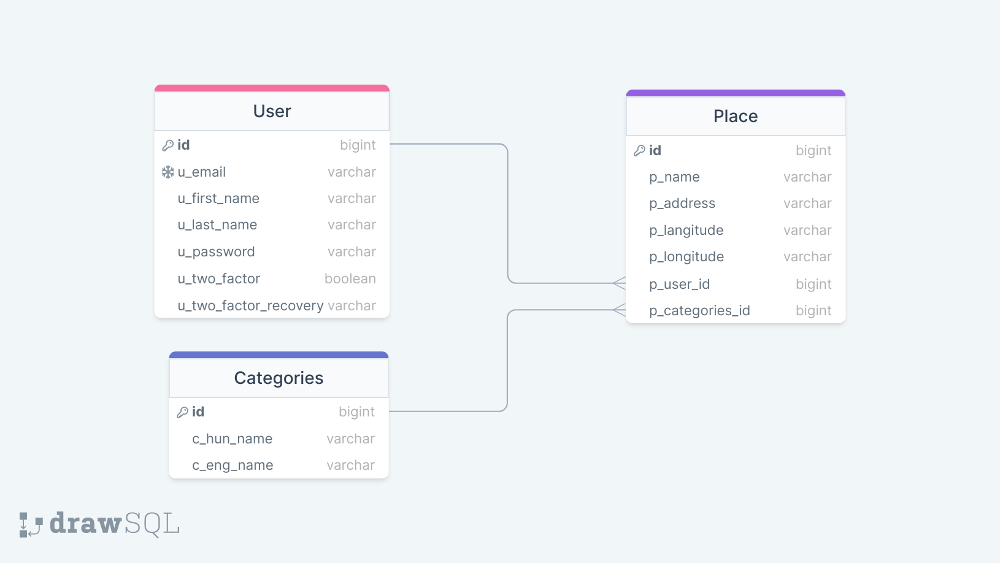
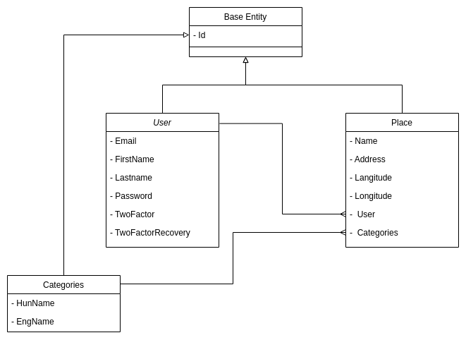

# Travelling Guide Application

## Functional requirements
| Requirement  | Description  |
|---|---|
| User Registration/Login  | Users can create accounts or log in via social media to access the app's features.  |
| Search Functionality  | Users can search for places by city, category (e.g., restaurants, landmarks, hotels), or specific keywords.  |
| Place Details  | Detailed information about each place, including descriptions, photos, reviews, ratings, and operating hours  |
| Maps Integration  | Integration with maps (e.g., Google Maps) to display the location of places and provide directions.  |
| Save and Favorite  | Users can save places they are interested in or mark them as favorites for quick access.  |
| Reviews and Ratings  | Users can leave reviews and ratings for places they've visited.  |
| Filters and Sorting  | Filters based on price range, distance, popularity, and sorting options for search results.  |
| Offline Access  | Ability to save information offline for use in areas with limited connectivity.  |
| Notifications  | Alerts for saved/favorite places' updates, new recommendations, or nearby attractions.  |

## Non-functional Requirements:
| Requirement  | Description  |
|---|---|
| Performance  | App should load quickly and have responsive features to enhance user experience.   |
| Scalability  | Able to handle a large number of users and data without compromising performance.  |
| Security  | Secure user data, encryption of sensitive information, and safe storage of login credentials.   |
| Cross-Platform Compatibility  | Compatibility with various browsers and across different mobile platforms (iOS, Android).   |
| Usability and Accessibility  | Intuitive and easy-to-navigate user interface, accessible to users with disabilities.  |
| Reliability  | Minimize system downtime, ensuring the app is available and reliable at all times.   |
| Data Backup  | Regularly back up user data to prevent loss in case of system failure.   |
| Compliance  | Adherence to data protection laws and regulations in different regions (e.g., GDPR, CCPA).   |
| Performance Metrics  | Implement tracking and analysis tools to monitor app usage, user engagement, and performance metrics.  |
 

## Modules
- [Travelling Rest API](https://github.com/BBence9807/travelling-app-api)
- [Travelling Auth Server](https://github.com/BBence9807/travelling-app-auth)

## System architecture diagram

## Database schema diagram

## Entities UML diagram
